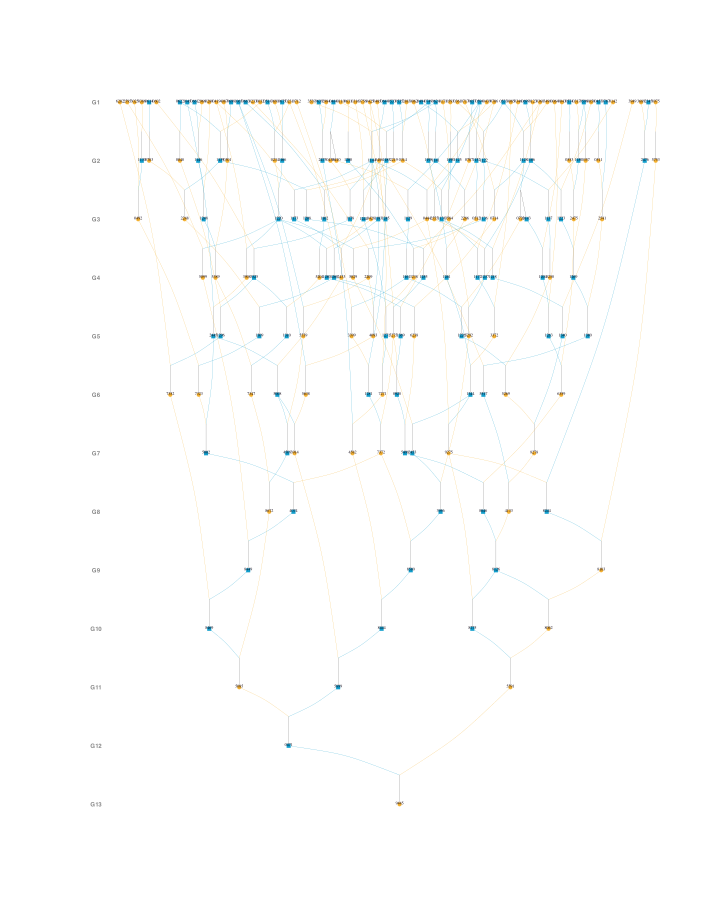

Search "plot pedigree in R" and you will meet a crowd: kinship2, the
two-decade-old grandparent of the field; its modern descendants Pedixplorer
and ggpedigree; pedtricks, written for quantitative genetics in wild
populations; optiSel's `pedplot()`, tucked inside a breeding-program
optimization suite; and visPedigree, which I maintain. Seven packages, six
plot functions — and several different purposes, because these packages are
not really in competition with one another.

kinship2 and its descendants were designed for human family studies, where
pedigrees are small, curated by hand, and complete on both parental sides.
visPedigree was designed for animal and plant breeding populations, where
pedigrees are large, often messy, and full of partial parentage. Each
package is good at the job it was built for, and the right choice simply
depends on which job is yours. For a breeding pedigree, visPedigree is the
natural first choice; the others shine in the settings they were designed
for.

To show what this means in practice, this article feeds the same real
Hinterwald cattle pedigree to all six plotting functions, timed on the same
machine, and reports what each package asks of the data along the way —
because that is where the packages differ most.

## The landscape

| Package | First released | Plot function | Graphics | Built for |
|---|---|---|---|---|
| [kinship2](https://cran.r-project.org/package=kinship2) | 2004 | `plot.pedigree()` | base R | Human family studies (aligned pedigree layouts) |
| [pedtricks](https://cran.r-project.org/package=pedtricks) | 2016 | `draw_ped()` | base R | Natural populations, quantitative genetic inference |
| [visPedigree](https://cran.r-project.org/package=visPedigree) | 2018 | `visped()` | base R | Breeding pedigrees, any size, integrated analysis |
| [optiSel](https://cran.r-project.org/package=optiSel) | 2018 | `pedplot()` | base R (kinship2) | Optimum contribution selection |
| [Pedixplorer](https://bioconductor.org/packages/Pedixplorer) | 2022 | `plot(Pedigree)` | ggplot2 | Bioconductor pedigree explorer with a Shiny app |
| [ggpedigree](https://cran.r-project.org/package=ggpedigree) | 2024 | `ggPedigree()` | ggplot2 + plotly | Custom-styled and interactive pedigree diagrams |
| [purgeR](https://cran.r-project.org/package=purgeR) | 2018 | — (`ped_graph()` builds igraph input only) | — | Inbreeding and purging analysis |

Three of them are related: optiSel's `pedplot()` calls kinship2's
`plot.pedigree()` under the hood, and ggpedigree incorporated kinship2's
alignment algorithms in version 1.0 as kinship2 approaches deprecation.
Pedixplorer is the Bioconductor re-implementation of the kinship2 data
model, with a ggplot2 plot layer and a Shiny explorer.

## The same pedigree, six ways

To compare them on equal footing, I took a real pedigree down to a
manageable size. From the Hinterwald cattle demo pedigree distributed with
optiSel (`optiSel::ExamplePed`, 1,179 animals born 1947–1995), I took the
ten animals born in 1995 and traced each one's ancestry back two
generations with `tidyped(..., cand = ..., trace = "up", tracegen = 2)`.
Parents that fall outside the traced set are coded as unknown — the
preparation the kinship2-family tools expect — leaving a 30-animal breeding
pedigree with overlapping generations, used for every panel and every
small-pedigree timing below. To keep the figures readable, the labels show
only the last four digits of each animal's ID.

::: {.column-screen-inset}

::: {layout-ncol=3}

{fig-alt="Pedigree plot by visPedigree showing 30 Hinterwald cattle"}

{fig-alt="Pedigree plot by kinship2"}

{fig-alt="Pedigree plot by ggpedigree"}

{fig-alt="Pedigree plot by pedtricks"}

{fig-alt="Pedigree plot by optiSel pedplot"}

{fig-alt="Pedigree plot by Pedixplorer"}

:::

*The same 30-animal Hinterwald pedigree plotted by six packages; labels show
the last four digits of each animal's ID. Nothing here required a synthetic
dataset — every panel is a documented call on real breeding data.*

:::

The panels show the design trade-offs directly. kinship2 and its descendants
put couples side by side in an aligned layout designed for human family
studies. pedtricks stacks generations vertically with dots, designed to
overlay trait data. visPedigree uses a Sugiyama layered layout — the
topological sort places ancestors strictly above descendants, which is what
you want when reading inheritance paths in a breeding pedigree.

## One individual, traced back to the founders

The 30-animal pedigree above is small enough that every package handles it
comfortably. The figure below shows the other direction visPedigree was
designed for: depth. One 1995-born Hinterwald animal, traced back through
thirteen generations to the founders — 205 animals in total — and drawn
with a single `visped()` call. The layered layout places every generation
on its own level, ancestors strictly above descendants, so an inheritance
path reads from top to bottom:

{fig-alt="Deep pedigree plot of one animal traced back thirteen generations to founders" width=100%}

*One call: `visped()` on the traced pedigree, with generation labels on
the left. Labels show the last four digits of each animal's ID.*

For comparison, the timings below are measured on the complete 1,179-animal
pedigree behind this figure — the size where the packages show their
different design targets: Pedixplorer's default label scaling declines to
render until the label size is set by hand, and the kinship2-family
alignment solver spends the better part of a minute on layout. Neither is a
flaw — those packages were tuned for the small, hand-curated pedigrees of
human family studies. It is simply a different job.

## Data preparation: what each package asks of you

Before timing anything, each package had to accept the data. This is where
the packages differ most, and it is worth knowing before you start:

- **kinship2 assumes complete parentage.** Its `pedigree()` constructor
  expects every individual to have both parents known or neither — the
  natural assumption for human-study pedigrees, less so for breeding
  records. The union of all ten candidates' two-generation traces (59
  animals) does not satisfy it as-is, and even the 30-animal pedigree above
  must have its out-of-set parents coded as unknown first. The full
  1,179-animal pedigree happens to be complete, so it passes unmodified.
  optiSel's `pedplot()` and ggpedigree's `ggPedigree()` follow the same
  rule.
- **Pedixplorer needs hand-tuned labels on larger pedigrees.** On the full
  1,179-animal pedigree, the default label auto-scaling reports that labels
  "leave no room for the graph". It renders after manually setting a small
  `cex`.
- **ggpedigree expects a specific column contract** — `personID`, `momID`,
  `dadID`, `famID`, `sex`, and a `spouseID` column that must exist even when
  every value is missing. ID columns must also agree on class: ExamplePed's
  factor-coded IDs read as numeric against the character `spouseID` column,
  and the mixed classes abort the plot. One `as.character()` call fixes it.
- **pedtricks wants a sex vector as a separate argument**, coded 0/1, with
  unknown sex mapped to one of the codes.
- **optiSel's `pedplot()` requires sex as `"male"`/`"female"` character
  values** — numeric codes 1/2 are rejected.
- **purgeR's `ped_graph()` requires integer ID columns** — ExamplePed's
  15-digit IDs exceed R's integer range, so they had to be remapped to
  1..1179 — and unknown parents must be coded 0: `NA` values make its
  C-level inbreeding functions crash. And it does not plot at all: it only
  builds an edge list for igraph, which you must plot yourself.
- **visPedigree accepts the raw three-column table.** Missing parents coded
  as `NA`, `0`, `*`, or blank are standardized by `tidyped()`; sex is
  inferred or passed as-is; partial parentage, overlapping generations, and
  selfing are all handled. The same object then feeds analysis functions
  directly.

None of these are shortcomings. They are design priorities: kinship2-family
tools optimize for human-study pedigree validity, visPedigree for breeding
records at scale.

## Timings

All timings below were measured on the same machine (Apple M2, 16 GB RAM,
R 4.5.2), with one warm-up call followed by five timed repetitions, median
reported. Each package's plot call was timed inside a null PDF device, so
layout computation is included and disk rendering is excluded; data and
pedigree objects were prepared once, outside the timed region. Label sizes
were reduced where a package required it (Pedixplorer on the full
pedigree); label size changes only the text rendering, not the layout being
solved.

| Package | 30 animals (median, s) | 1,179 animals (median, s) |
|---|---:|---:|
| pedtricks `draw_ped()` | 0.002 | 0.036 |
| optiSel `pedplot()` | 0.005 | 45.7 |
| kinship2 `plot.pedigree()` | 0.005 | 45.8 |
| Pedixplorer `plot()` | 0.042 | 49.0 |
| visPedigree `visped()` | 0.059 | 1.94 |
| ggpedigree `ggPedigree()` | 0.144 | 44.5 |

Two readings from this table. On a small pedigree, everything is fast —
the slowest call is 0.14 seconds, and at that size the choice is purely a
matter of style and of what your downstream workflow needs.

On a realistic breeding pedigree the ranking changes and the spread widens
to three orders of magnitude. The gap comes from the layout algorithms, not
from carelessness: kinship2 spends most of its 45.8 seconds solving an
alignment problem (75 seconds with `autohint()` hints enabled); optiSel's
`pedplot()` pays the same bill because it wraps the same solver, and
ggpedigree inherited kinship2's alignment algorithms at 44.5 seconds.
Pedixplorer's ggplot2 rendering is slowest at 49.0 seconds — and that is
with the label size hand-tuned, because the default declines to run at that
size. pedtricks stays fast because it only sorts by depth. visPedigree sits
in between: its Sugiyama layout iterates up to `maxiter = 1000` passes to
reduce edge crossings by default, which is the bulk of its 1.94 seconds —
you can lower `maxiter` for draft views and raise it for final figures.
purgeR has no row in the table because it has no plot function:
`ped_graph()` builds the igraph edge list in 0.001 seconds and leaves the
drawing to you.

Read the table together with the data-preparation section above: each
number is the time *after* its package's documented requirements were met.
The requirements themselves are usually the more relevant information.

## Scaling beyond plotting: the full workflow

For comparison, the full visPedigree workflow benchmark from our recent
paper [Luan et al. 2026, *Bioinformatics Advances*](https://doi.org/10.1093/bioadv/vbag210)
(reported as Table S2 there; ~20,000 individuals per generation):

| Workflow | 100k | 500k | 1M |
|---|---:|---:|---:|
| `tidyped()` + `inbreed()` | 0.19 s | 0.88 s | 1.90 s |
| `tidyped()` + `pedstats()` | 0.55 s | 2.64 s | 5.61 s |
| `tidyped()` + `pediv()` | 0.57 s | 2.61 s | 5.46 s |
| `tidyped()` + `pedprod()` | 0.17 s | 0.86 s | 1.96 s |

These are end-to-end times on a simulated pedigree with 150 founders and
20,000 offspring per generation (1,000,150 records at the 1M scale).
Benchmark data and scripts are on Zenodo
([doi:10.5281/zenodo.21320956](https://doi.org/10.5281/zenodo.21320956)).
No other package in the comparison offers a documented pipeline at this
scale; this table documents where visPedigree's design budget went — into
the analysis chain behind the plot, not only into the plot.

## Feature chain: what each package can do beyond the plot

The table below adapts Table S1 from [Luan et al. 2026](https://doi.org/10.1093/bioadv/vbag210),
extended with two plotting-focused packages (ggpedigree, pedtricks) that the
paper did not cover. "Yes" means a documented end-user workflow; "Partial"
means the quantity is derivable indirectly or exposed only as a by-product;
"No" means no documented support.

| Workflow component | visPedigree | Pedixplorer | purgeR | optiSel | nadiv | kinship2 | ggpedigree | pedtricks |
|---|---|---|---|---|---|---|---|---|
| Pedigree standardization / validation | Yes | Partial | Partial | Partial | Partial | Partial | No | No |
| Candidate-centered tracing / trimming | Yes | Yes | No | Partial | Partial | Yes | No | Partial |
| Inbreeding coefficients | Yes | Partial | Yes | Yes | Partial | Partial | No | No |
| Exact partial inbreeding | Yes | No | Yes | No | No | No | No | No |
| Founder / ancestor diversity (f~e~, f~a~, f~g~) | Yes | No | Yes | Partial | No | No | No | No |
| Effective population size summaries | Yes | No | Yes | Yes | No | No | No | No |
| Relationship summaries / kinship | Yes | Partial | No | Yes | No | Yes | No | No |
| Relationship matrices (A, A⁻¹, non-additive) | Yes | No | No | Yes | Yes | No | No | No |
| Pedigree plotting / visualization | Yes | Yes | No | Partial | No | Yes | Yes | Yes |
| Explicit full-sib compaction for display | Yes | No | No | No | No | No | No | No |
| Temporal diversity diagnostics | Yes | No | No | No | No | No | No | No |

Notes (following the paper's conservative coding): nadiv returns inbreeding
coefficients as a by-product of `makeDiiF()`; kinship2 and Pedixplorer
inbreeding values can be derived from the kinship-matrix diagonal; purgeR's
`ped_graph()` builds igraph input but the package exports no plot function;
pedtricks' `draw_ped(focal = ...)` plots the relatives of a focal individual
(offspring, descendants, parents, ancestors, kin) and can prune to
informative links, hence "Partial" for tracing.

The pattern in the table is not "which package is best" — it is "which job
each package was built for". kinship2/Pedixplorer/ggpedigree/pedtricks are
plotting-and-structure tools; purgeR and optiSel are analysis tools with
specific targets (purging, optimum contribution); nadiv is a matrix
workbench. visPedigree is the only one whose `tidyped()` object carries the
whole chain from standardization to analysis to plotting — which also means
that users who only want a quick plot, and already have a tidy pedigree,
may find it more than they need.

## Which one should you use?

- **You work with an animal or plant breeding pedigree** — large, with
  overlapping generations and partial parentage — and you want analysis
  plus a figure (inbreeding, diversity, effective size, matrix-free
  products): visPedigree is the first choice, with `visped()` for the plot.
- **You have a human family-study pedigree and want the classic aligned
  layout**: kinship2 today, Pedixplorer or ggpedigree as the maintained
  successors.
- **You want interactive pedigree plots with tooltips**: ggpedigree's
  plotly wrapper.
- **You work with natural populations and want to overlay trait data or
  focal relatives on the pedigree**: pedtricks.
- **You are already inside an optiSel workflow** (kinships, native
  contributions): `pedplot()` keeps your pipeline in one package.
- **You need purging or inbreeding-load statistics**: purgeR — pair it with
  a plotting package, because it has none of its own.

## Disclosure and reproducibility

I am the maintainer of visPedigree. The feature-chain table adapts the
published supplementary material of our paper
([DOI 10.1093/bioadv/vbag210](https://doi.org/10.1093/bioadv/vbag210));
the two added columns were verified against the current CRAN documentation of
ggpedigree 1.2.0 and pedtricks 0.5.0. Every other "Yes/Partial/No" entry was
re-verified against locally installed packages on 2026-08-24 before writing.

All scripts used to produce the figures and timings in this article are
available in the blog repository
([`scripts/plot-pedigree-comparison.R`](https://github.com/luansheng/lsblog/blob/main/scripts/plot-pedigree-comparison.R)
for the figures,
[`scripts/plot-pedigree-timings.R`](https://github.com/luansheng/lsblog/blob/main/scripts/plot-pedigree-timings.R)
for the timings). The timing protocol is the same one used in the paper:
warm-up plus five repetitions, median reported.
