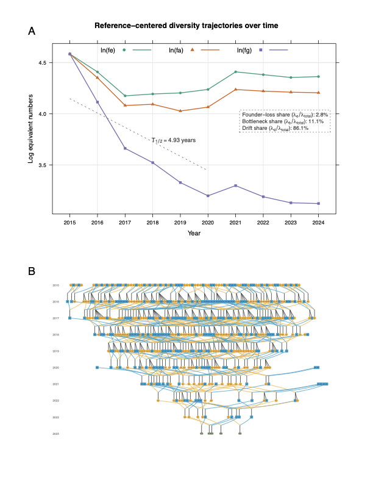

近日，由中国水产科学研究院黄海水产研究所虾类遗传资源与育种团队开发的 visPedigree 软件论文 **"visPedigree: a comprehensive R package for tidying, analyzing, and visualizing breeding pedigrees"** 在 *Bioinformatics Advances* 正式发表（DOI: [10.1093/bioadv/vbag210](https://doi.org/10.1093/bioadv/vbag210)）。visPedigree 是一款面向动物、植物及水产育种的 R 软件包，聚焦于复杂系谱数据的整理、分析和可视化。

## 面向育种实践中的复杂系谱数据问题

系谱数据是遗传育种中的基础数据，支撑着亲缘关系控制、选配方案制定、近交监测和遗传多样性评估等关键环节。然而，在实际育种工作中，大型群体的系谱数据往往需要用不同的工具和数据结构分别完成整理、分析和可视化，这种碎片化使常规分析流程变得繁琐且容易出错。

更具体地说，真实育种系谱具有三个常被忽视的结构复杂性：其一，水产和植物育种中常见的高繁殖力物种，单对亲本可产生大量全同胞后代，导致系谱结构极不平衡；其二，育种群体世代深度参差不齐——并非所有个体都能追溯至相同世代；其三，多批次、多世代的重复评估使得系谱数据持续增长且结构不断变化。传统的手工整理方式或通用数据处理工具难以有效应对这些特点。

visPedigree 正是围绕上述实际问题持续开发的解决方案。它通过设计统一的 `tidyped` 对象模型，将系谱整理、结构校验、可视化、近交分析和群体遗传评估整合在同一框架内，避免数据在不同工具间反复转换。该软件最早于 2018 年在 GitHub 发布，经过多年使用和完善，近期完成了系统整理、CRAN 发布和同行评议论文发表，为后续推广应用、结果复现和规范引用提供了基础。

## 构建标准化的 `tidyped` 系谱对象

针对实际系谱数据来源复杂、格式不统一、父母本信息不完整、个体排序混乱等问题，visPedigree 设计了标准化的 `tidyped` 系谱对象。

通过 `tidyped()` 函数，用户可以将原始系谱表整理为结构规范、可直接用于后续分析的对象。在这一过程中，软件可完成个体排序、父母本关系检查、世代推断、缺失亲本处理、候选个体追踪和循环系谱检测等操作。

这一设计使系谱整理、结构校验、可视化、近交分析、遗传多样性分析和关系矩阵相关计算能够基于统一数据对象完成，有助于减少重复数据整理和不同分析流程之间的格式转换，提高分析流程的规范性和可复用性。

## 支持复杂系谱追踪与可视化

在育种研究中，研究人员经常需要追溯候选个体的祖先来源，分析某一家系在后续世代中的延续情况，或展示多世代育种群体的亲缘结构。

visPedigree 支持候选个体的祖先追踪、后代追踪和双向追踪，并可将追踪结果绘制为多世代系谱图。软件可根据世代信息自动排列个体，并支持根据性别、角色或用户自定义信息设置节点样式，便于研究人员直观展示复杂群体结构。

针对育种群体中常见的大型全同胞家系，特别是对虾、鱼类等高繁殖力水产动物中一个家系后代数量大的特点，visPedigree 提供了紧凑展示方式。该功能可以将同一父母本组合产生的大量全同胞个体压缩为家系节点（图中 `FS×N` 矩形节点），在保留主要系谱结构信息的同时，提高复杂系谱图的可读性和展示效果。

## 拓展系谱群体遗传分析功能

visPedigree 不仅用于系谱图绘制，也整合了多种基于系谱的群体遗传分析功能。

软件支持计算近交系数、系谱完整性、等效完整世代、世代间隔，以及有效 founder 数、有效 ancestor 数和有效群体大小等经典群体遗传指标，可用于评估育种群体的近交积累、祖先贡献不均衡和遗传多样性损失情况。

在此基础上，visPedigree 进一步引入了基于 Shannon 信息熵的有效 founder 数和有效 ancestor 数（记为 feH 和 faH）。与经典指标相比，feH 和 faH 对低频始祖和祖先贡献更为敏感，能够反映群体中是否存在尚未完全丢失、仍可通过计划选配恢复的"长尾"遗传多样性。

此外，软件提供了多样性半衰期（diversity half-life）分析工具，可在时间序列上追踪群体遗传多样性的衰减趋势，并将其分解为始祖贡献不均、世代瓶颈传递和世代内随机漂变三个组分的贡献。这有助于育种管理者判断多样性下降的主要来源——是建群基础不够均衡、中间世代收缩过快，还是长期闭锁导致的逐代漂变——从而有针对性地调整选配策略。

对于长期闭锁或半闭锁选育群体，上述分析可为亲本选择、近交控制、群体结构优化和种质资源管理提供辅助决策依据。

## 提升大规模系谱数据处理能力

随着育种规模扩大和长期系谱数据积累，育种群体中的个体数量可能达到十万级甚至百万级。在大规模系谱分析中，传统关系矩阵相关计算往往需要显式构建完整的 $n \times n$ 矩阵，容易带来较高的内存和计算压力。

visPedigree 在部分计算中支持不显式构建完整矩阵，而是直接进行矩阵向量乘法等操作，例如计算 $\mathbf{A}\mathbf{x}$ 或 $\mathbf{A}^{-1}\mathbf{x}$。这一设计为大规模系谱数据处理提供了更加灵活的实现方式，有助于提高大型育种群体分析效率。

## 已在多个研究场景中得到应用

在正式软件论文发表之前，visPedigree 已被多个外部研究团队在论文中使用或引用，应用场景涵盖畜禽育种、保护遗传、人类谱系研究和大规模系谱质量控制等方向。

- **畜禽育种**：在 Gochu Asturcelta 猪的单倍型分析和孟德尔错误研究中用于系谱可视化（Arias et al., *BMC Genomics* 2024; *Scientific Reports* 2022）；在泽西牛面部畸形研究中用于追溯共同祖先（Vander Jagt et al., *AAABG* 2023）；在 Silla Argentino 马的群体遗传分析中用于系谱数据整理（León Rubio et al., *SPERMOVA* 2021）。
- **保护遗传**：在东非黑犀牛保护研究中，用于构建观测系谱并分析近交水平，比较自然扩散与人工转移的遗传效果（Mellya et al., *PNAS* 2025）；在野生驯鹿亲缘关系研究中用于系谱构建（Jones et al., *Global Ecology and Conservation* 2023）。
- **人类谱系研究**：用于追踪 10 个世代的历史人类群体后代延续情况（Young et al., *Proceedings of the Royal Society B* 2023）。
- **犬系谱质控**：在拉布拉多犬研究中，用于辅助定位超过 148 万条系谱记录中的循环和亲本错误（Lee et al., *Genetics Selection Evolution* 2025）。

此外，遗传育种模拟软件 **MoBPS** 已将 visPedigree 的 `tidyped()` 和 `visped()` 直接整合进其系谱可视化模块，CRAN Task View: Agricultural Science 也将 visPedigree 列入动物科学推荐工具。自2026年1月在cran发布以来，累计下载量已2900余次。

更多应用案例详见：<https://luansheng.github.io/visPedigree/articles/applications.html>

这些应用表明，visPedigree 虽然源于水产育种实践需求，但其功能可扩展至更广泛的亲缘关系分析、谱系追溯和群体遗传研究场景。

## 为智能化精准育种提供基础工具支撑

当前，水产种业正由传统表型和系谱选择，逐步向基因组选择、智能表型测定、多源数据融合和智能化育种决策方向发展。在这一过程中，规范、可靠、可复用的数据分析工具是提高育种效率的重要基础。

visPedigree 可作为家系选育、基因组选育、遗传多样性监测和智能育种分析流程中的基础模块，用于支撑系谱数据整理、群体结构检查、候选个体追踪、近交控制和群体遗传状态评估等工作。未来，团队将继续围绕水产遗传育种中的实际需求，完善系谱分析、基因组选育、智能表型和育种数据管理等工具，推动育种数据分析流程更加标准化、自动化和可复用。

## 软件获取与相关信息

| 项目 | 信息 |
|------|------|
| 软件名称 | **visPedigree** |
| 功能定位 | 复杂育种系谱数据整理、分析和可视化 R 软件包 |
| CRAN | `install.packages("visPedigree")` |
| GitHub | <https://github.com/luansheng/visPedigree> |
| 文档 | <https://luansheng.github.io/visPedigree/> |
| 软件论文 | *Bioinformatics Advances*, DOI: [10.1093/bioadv/vbag210](https://doi.org/10.1093/bioadv/vbag210) |

## 小结

从 2018 年在 GitHub 上发布第一个版本，到如今完成 CRAN 发布和同行评议论文发表，visPedigree 的每一步改进都来自实际育种数据分析中的真实需求。栾生研究员为论文第一作者和通讯作者。如果你在处理系谱数据时遇到整理、分析或可视化方面的问题，欢迎尝试 visPedigree，也欢迎通过 GitHub Issues 提交反馈和建议。
